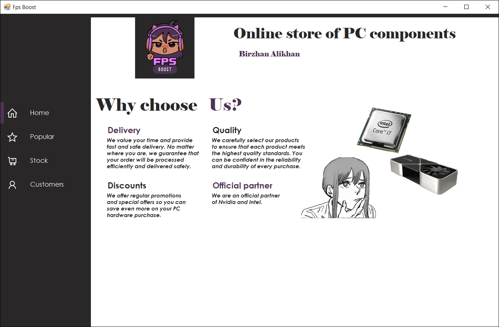
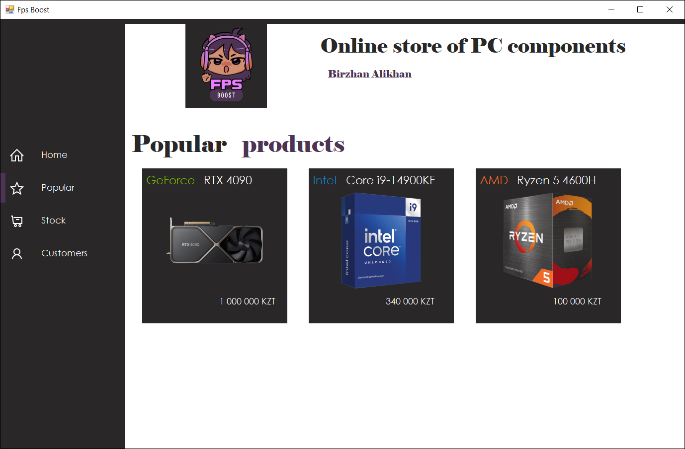
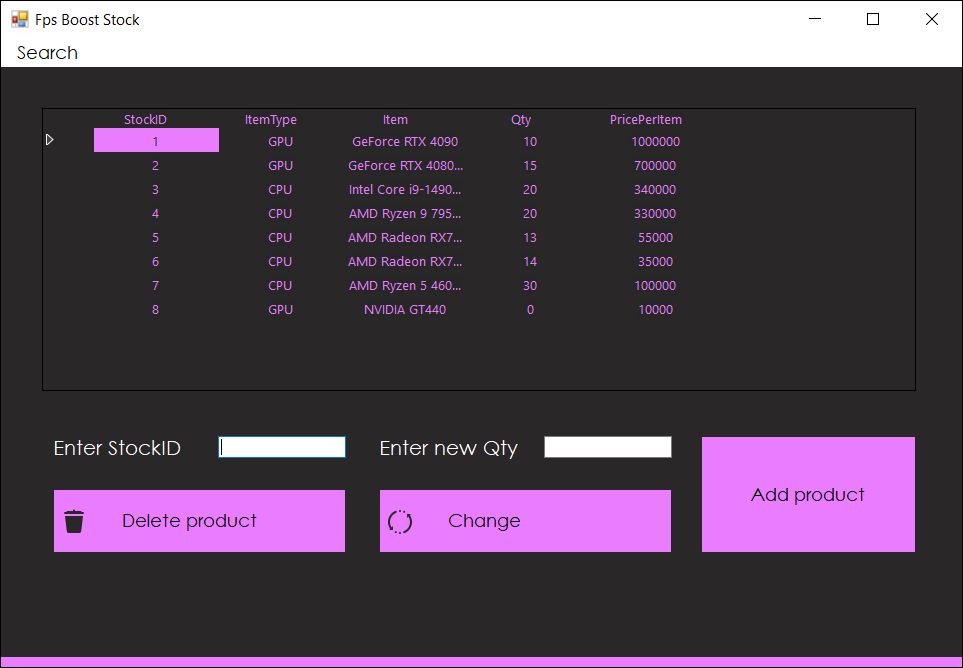
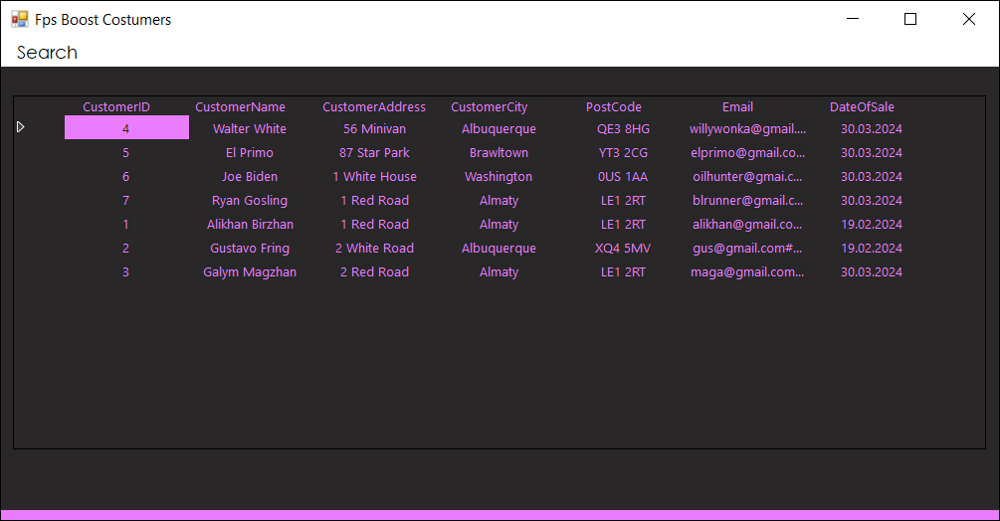

# Fps Boost - Online Store for PC Components

## Project description

**Fps Boost** is a Windows Forms application for managing an online store specializing in the sale of PC components. This project was developed as part of a university course to apply and improve C# and database skills.

### Key Features

- **Intuitive navigation**: Simple and convenient navigation through the main sections: Home, Popular, Stock, Customers.
- **Product Management**: View and manage PC components available for purchase.
- **Customer Management**: View customer data and manage their orders.
- **Database Integration**: Uses Microsoft Access database to store and retrieve data efficiently.

### Screenshots

#### Home page

#### Popular products

#### Stock page

#### Customers page

### Contact

For any questions or suggestions, feel free to reach out:
- **Email**: [supsx1yxn@gmail.com](mailto:supsx1yxn@gmail.com)
